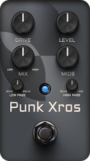

# PunkXros
 

## Introduction
This is a simple vst3/au multiband distortion plugin made with [JUCE](https://juce.com/) that I built to introduce myself in the JUCE framework. The functionality is somewhat inspired by the [Microtubes X by Darkglass](https://www.darkglass.com/creation/microtubes-x/), but I implemented my own processing without trying out the original pedal. I also used Machine Learning to train a model based on the [Darkglass Microtubes B3k pedal](https://www.darkglass.com/creation/microtubes-b3k/).

## Features
- **Low frequencies processing**:
    - Low pass: Selects the cutoff frequency (between 50-500Hz) at which a low-pass filter is applied.
    - The `Level` control increases the input gain of a compressor that is only applied to this band.
- **High frequencies processing**: ±12dB of gain that feed a parallel exciter processor.
    - High pass: Selects the cutoff frequency (between 100-1000Hz) at which a high-pass filter is applied.
    - The `Level` control increases the input gain of a distortion that is only applied to this band.
- **Mix**: Blends the low and high frequencies bands.
- **Mids**: ±12dB at 500Hz applied after the previous processing.
- **Level**: Output gain.

## Interesting links

* [Neural Networks for Real-Time Audio](https://medium.com/nerd-for-tech/neural-networks-for-real-time-audio-introduction-ed5d575dc341)
* [TS-9 cloned with Machine Learning](https://github.com/GuitarML/TS-M1N3/tree/main)
* [RTNeural](https://github.com/jatinchowdhury18/RTNeural)